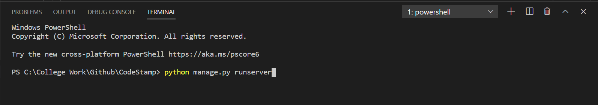
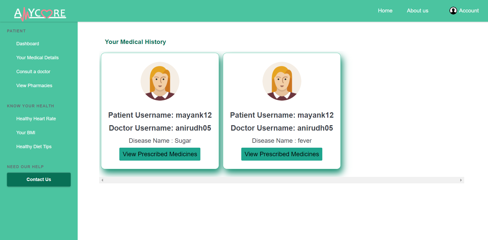

<h1 align="center">AMYCARE</h1>
  
"The heart of your healthcare"

    
<h2>Project Description</h2>
 
Amy Care is a patient-centered information exchange system where the patients, doctors and the pharmacists are all connected under one roof.
   It is also about coordinating benefits and services with the medical providers, managing internal database and processing medical records.
 

<h2>Installation</h2>

<strong>Requirements:</strong>

<ul>
  <li>Python Version 3.5 and above</li>
  <li>Django</li>
</ul>

<strong>Installation:</strong>

<ol>
  <li>You can download Python from <a href="https://www.python.org/downloads/">here</a></li>
  <li>After downloading, install Python on your device</li>
  <li>After installing, run <strong>python --version</strong> on Command Prompt and if version is displayed then the installation is successful</li>
  <li>If it shows an error then refer <a href="https://docs.python.org/3/using/windows.html">here</a> to proceed further</li>
  <li>After complete installation, install Django by running <strong>py -m pip install Django</strong> in Command Prompt.</li>
  <li>If it shows an error then refer <a href="https://appuals.com/fix-pip-is-not-recognized-as-an-internal-or-external-command/">here</a> to proceed further</li>
  <li>Now you are all set to run the project</li>
</ol>

<h2>Testing the project</h2>
  
To test the project follow the steps below👇
  <ol>
    <li>We can test the project on local server</li>
    <li>To run it type the command <strong>python manage.py runserver</strong> on Command Prompt</li>
    <li>Then click on the link that will appear after running the command</li>
    <li>It will redirect you to the website</li>
  </ol>
  
Note⚠: Remember you need to run the above command in folder that has the file <i>manage.py</i> 
   i.e. before running the command change the directory path to the folder with the above file as shown in the image below.

 

<h2>Website Clips</h2>
  
<kbd></kbd> <kbd></kbd>

  
<h2>Usage</h2>
  
After clicking the link you will be redirected to the main page. To proceed check the steps👇

  <ol>
  <li>You need to login/signup from the button provided as one of the three options i.e.
     <ul>
      <li>Patient</li>
      <li>Doctor</li>
      <li>Pharmacist</li>
     </ul>
  <li>After successful login you need to complete your profile.</li>
  <li>For Patient</li>
     <ul>
      <li>You can use the sidebar to access different services and features</li>
      <li>Check the pharmacies and doctors currently added with us</li>
      <li>To test already added patient profile use Username="<i>mayank12</i>" and Password="<i>mayank12</i>"</li>
     </ul>
  <li>For Doctor</li>
     <ul>
     <li>You can use the sidebar to add and remove patients</li>
     <li>Check upcoming appointments</li>
     <li>To test already added doctor profile use Username="<i>anirudh05</i>" and Password="<i>anirudh05</i>"</li>
     </ul>
  <li>For Pharmacist</li>
      <ul>
       <li>You can use the sidebar to check the prescription of the patients</li>
       <li>To test already added doctor profile use Username="<i>geet1</i>" and Password="<i>geet1</i>"</li>
      </ul>
  </ol>
  
  
Made by ❤ by team <b>CodeStomp</b>

